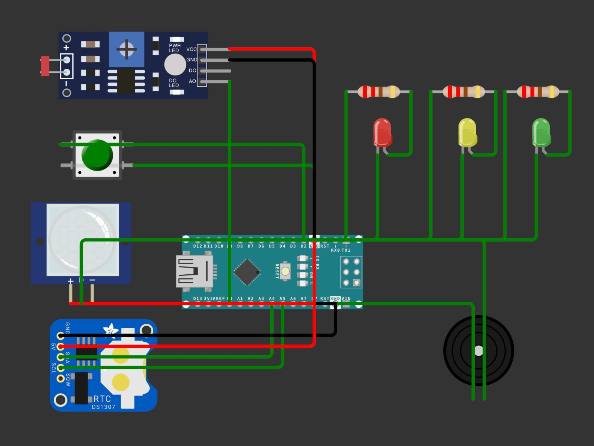

# 🚦 Smart School-Zone Traffic Controller
### MPCA Mini Project | 4th Semester | PES University EC Campus

---

## 📌 Project Overview

A context-aware traffic light controller designed specifically for school zones. Unlike a standard traffic light that runs on a fixed timer 24/7, this system is **intelligent** — it activates only during school hours, responds to pedestrian requests, verifies a person is actually present before stopping traffic, and automatically adjusts LED brightness based on ambient light conditions.

---

## 🧠 How It Works

The system operates in two modes:

- **Active Mode** (8:00–9:00 AM and 3:30–4:30 PM): Full traffic control with pedestrian crossing capability
- **Standby Mode** (all other times): Yellow LED blinks slowly to indicate caution; button override still works

### Crossing Cycle (triggered by button + PIR confirmation):
1. Green LED on (normal traffic flow)
2. Pedestrian presses the button
3. PIR sensor confirms someone is actually standing at the crossing
4. Yellow LED → 2 second warning
5. Red LED on + Buzzer beeps → 10 second crossing window
6. Green LED resumes
7. 30 second cooldown before button works again

---

## 🔧 Components Used

| Component | Purpose |
|-----------|---------|
| Arduino Uno | Microcontroller |
| DS3231 RTC Module | Real-time clock for school hour scheduling |
| Push Button | Pedestrian crossing request input |
| PIR Motion Sensor | Confirms pedestrian is physically present |
| LDR Sensor Module | Detects ambient light for brightness adjustment |
| Red LED + 220Ω resistor | Traffic signal — Stop |
| Yellow LED + 220Ω resistor | Traffic signal — Caution |
| Green LED + 220Ω resistor | Traffic signal — Go |
| Passive Buzzer | Audio alert during crossing (accessibility) |
| Breadboard + Jumper Wires | Circuit connections |
| 9V Battery + Connector | Portable power supply |

---

## 📡 Sensors & Their Role

| Sensor | Type | Function |
|--------|------|----------|
| DS3231 RTC | Real-Time Clock | Switches between Active and Standby mode based on time |
| Push Button | Electromechanical | Receives pedestrian crossing request |
| PIR Motion Sensor | Passive Infrared | Verifies a person is physically standing at the crossing |
| LDR | Light Dependent Resistor | Adjusts system behavior based on ambient light levels |

---

## 🔌 Pin Connections

| Component | Pin | Arduino Pin |
|-----------|-----|-------------|
| RTC | SDA | A4 |
| RTC | SCL | A5 |
| RTC | VCC | 5V |
| RTC | GND | GND |
| Push Button | Signal | D2 |
| Push Button | GND | GND |
| PIR Sensor | OUT | D3 |
| PIR Sensor | VCC | 5V |
| PIR Sensor | GND | GND |
| LDR Module | AO | A0 |
| LDR Module | VCC | 5V |
| LDR Module | GND | GND |
| Red LED | Anode (via 220Ω) | D9 |
| Yellow LED | Anode (via 220Ω) | D10 |
| Green LED | Anode (via 220Ω) | D11 |
| Buzzer | + | D8 |
| Buzzer | − | GND |

---

## Circuit Diagram

---

## 🎯 Features

- ⏰ **RTC Scheduling** — Active only during school hours, standby otherwise
- 🚶 **Pedestrian Override** — Button triggers crossing cycle anytime
- 👁️ **PIR Verification** — Prevents false triggers from accidental button presses
- 💡 **LDR Light Sensing** — Monitors ambient light conditions
- 🔔 **Buzzer Alert** — Audio cue during crossing for visually impaired pedestrians
- ⏱️ **Cooldown Timer** — 30 second lockout after each crossing cycle

---

## 🛠️ Demo

---

## 📚 Concepts Applied (MPCA)

- Digital I/O pin control using ARM-based microcontroller
- I2C communication protocol (RTC module)
- Analog signal reading (LDR)
- Interrupt-style input handling (Button, PIR)
- Timer and delay management in embedded C
- Sensor integration and real-world interfacing

---
*Harshith R Reddy | PES2UG24CS188 |*  
*PES University EC Campus | 4th Semester MPCA Mini Project | 2025–26*